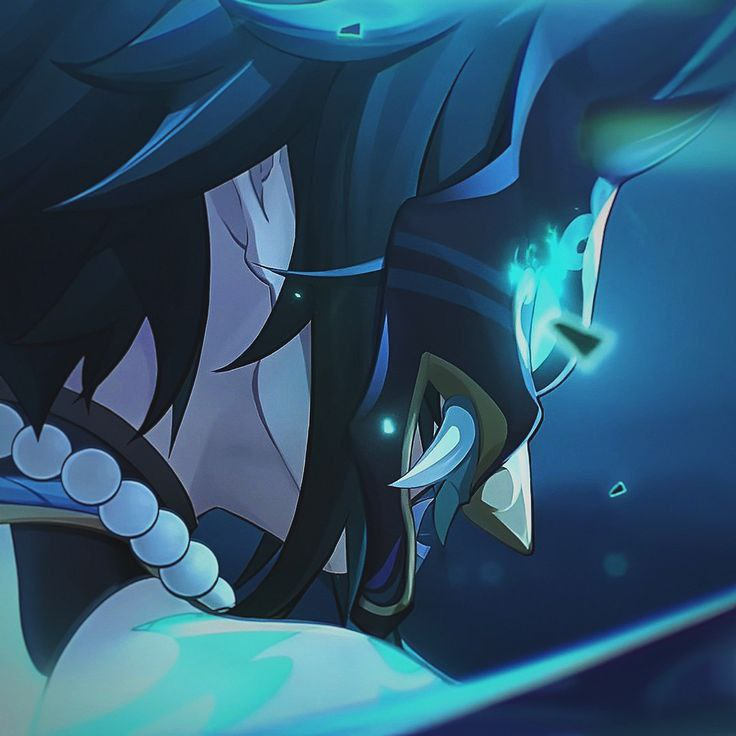
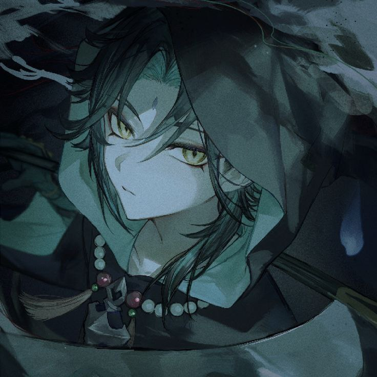

<h1 align="center">  𝓦𝓮𝓵𝓬𝓸𝓶𝓮 :wave: , 𝔂𝓸𝓾 𝓬𝓪𝓷 𝓬𝓪𝓵𝓵 𝓶𝓮 𝓚𝓪𝔂𝓸𝓽𝓪  </h1>
 

   <h2><b>This is my github profile</b></h2>
   <h3>𝐵𝑒 𝓎𝑜𝓊𝓇𝓈𝑒𝓁𝒻, 𝓉𝒽𝑒 𝓇𝑒𝓈𝓉 𝑜𝒻 𝓉𝒽𝑒   𝓇𝑜𝓁𝑒𝓈 𝒶𝓇𝑒 𝓉𝒶𝓀𝑒𝓃</h3>

 

  

 
<h2 align="center">:zap: 𝒜𝒷𝑜𝓊𝓉 𝑀𝑒 :zap:</h2>

   

 

<li><b>Name: Kayota</b></li>
<li><b>Age: 11</b></li>
<li><b>Region: UA</b></li>
<li><b>Hobbys: Web-Proggramming,Gaming</b></li>
<li><b>OS: Windows 10</b></li>
<li><b>Learning Now: JavaScript</b></li>
       

My Socials

  
<h2 align="center">:page_with_curl: 𝒯𝑒𝒸𝒽𝓃𝑜𝓁𝑜𝑔𝒾𝑒𝓈 </h2>

   

 
 
 
 
 
 
 
 
  
 
𝐼 𝓌𝒶𝓃𝓉 𝓉𝑜 𝒷𝑒𝒸𝑜𝓂𝑒 𝒶 𝒿𝓊𝓃𝒾𝑜𝓇 𝒻𝓇𝑜𝓃𝓉𝑒𝓃𝒹 𝒹𝑒𝓋𝑒𝓁𝑜𝓅𝑒𝓇   𝒶𝓃𝒹 𝐼'𝓂 𝓉𝓇𝓎𝒾𝓃𝑔 𝓉𝑜 𝓁𝑒𝒶𝓇𝓃 𝓉𝒽𝑒 𝓃𝑒𝒸𝑒𝓈𝓈𝒶𝓇𝓎 𝓉𝑒𝒸𝒽𝓃𝑜𝓁𝑜𝑔𝒾𝑒𝓈   𝓉𝑜 𝒶𝒸𝒽𝒾𝑒𝓋𝑒 𝓂𝓎 𝑔𝑜𝒶𝓁.

  

        
<h2 align="center">:phone: 𝒞𝑜𝓃𝓉𝒶𝒸𝓉𝓈 𝑀𝑒 :phone:</h2>

𝒯𝒽𝑒𝓈𝑒 𝒶𝓇𝑒 𝒸𝑜𝓃𝓉𝒶𝒸𝓉𝓈 𝓉𝑜 𝒸𝑜𝓃𝓉𝒶𝒸𝓉 𝓂𝑒 𝒾𝓃 𝒹𝒾𝒻𝒻𝑒𝓇𝑒𝓃𝓉 𝓈𝒾𝓉𝓊𝒶𝓉𝒾𝑜𝓃𝓈 (𝓌𝒽𝑒𝓃 𝓃𝑒𝒸𝑒𝓈𝓈𝒶𝓇𝓎)

  

<a href="https://discord.com/channels/@Kayota"></a align="end">
<a href="https://t.me/kayota_frontend"></a align="end">

              
<h2 align="center">:wave: Bye! :wave:</h2>

